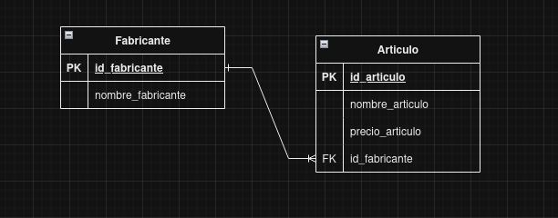
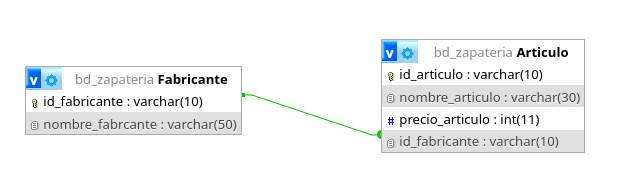
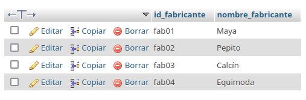
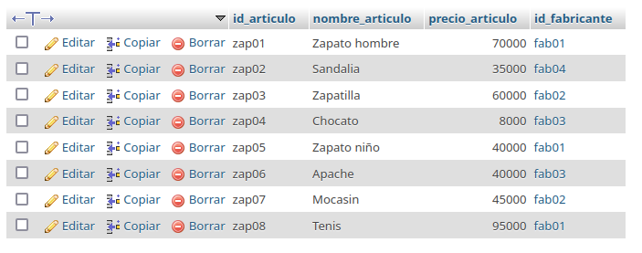
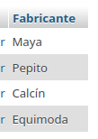

# Sistema para una zapateria

## Modelo entidad - relación

## Modelo físico de la BD

## Tabla Fabricante

## Tabla Artículo

## Consultas a la BD

1. Mostrar la lista de todos los fabricantes

`SELECT * FROM Fabricante;`

2. Mosrar la lista de nombres de los Fabricantes 

`SELECT nombre_fabricante FROM Fabricante`

3. Mostrar los nombres de los productos

`SELECT nombre_articulo FROM Articulo;`

