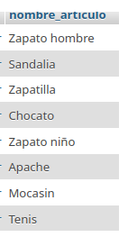

# Sistema para una zapateria

## Modelo entidad - relación

## Modelo físico de la BD

## Tabla Fabricante

## Tabla Artículo

## Consultas a la BD

1. Mostrar la lista de todos los fabricantes

`SELECT * FROM Fabricante;`

2. Mosrar la lista de nombres de los Fabricantes 

`SELECT nombre_fabricante FROM Fabricante`

3. Mostrar los nombres de los productos

`SELECT nombre_articulo FROM Articulo;`

4. Obtener los nombres y los precios de los productos de la tienda

`SELECT nombre_articulo AS Nombre; precio_articulo AS precio FROM Articulo;`

5. Obtener los nombres de ls articulos cuyo precio sea superior a 50000

`SELECT nombre_articulo FROM Articulo WHERE precio_articulo > 50000;`

6. Obtener el nombre de los artículos cuyo precio esté entre 5000 y 40000 (ambos incluidos)

### Forma 1

`SELECT nombre_articulo FROM Articulo WHERE precio_articulo >= 5000 AND precio_articulo <= 40000;`

### Forma 2

`SELECT nombre_articulo FROM Articulo WHERE precio_articulo BETWEEN 50000 AND 40000;`

